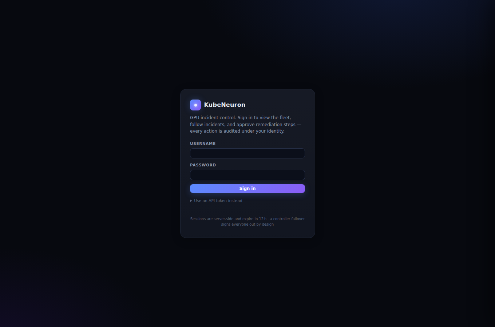
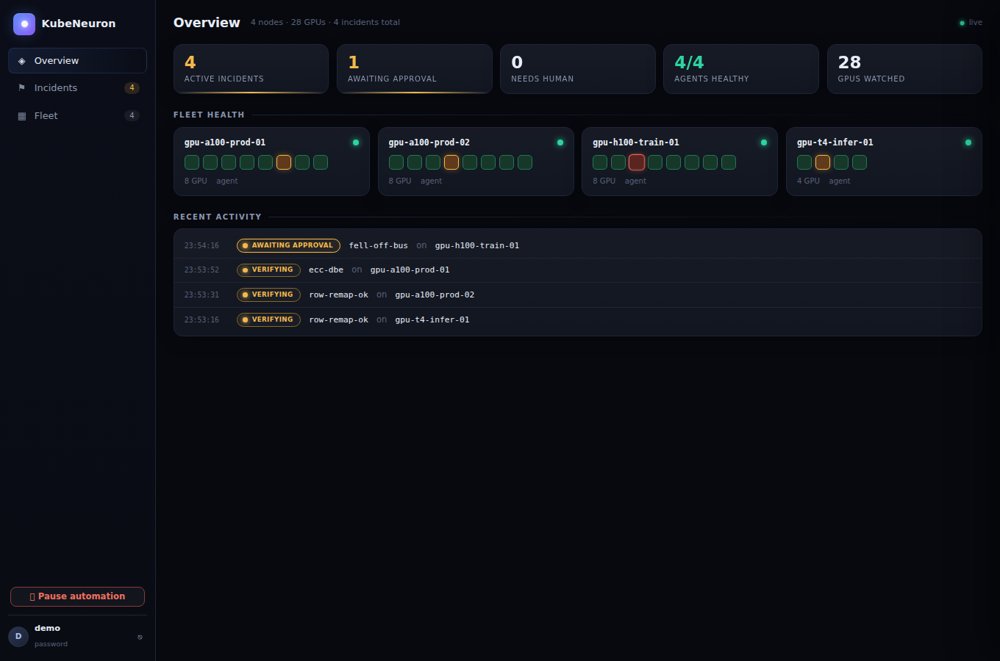
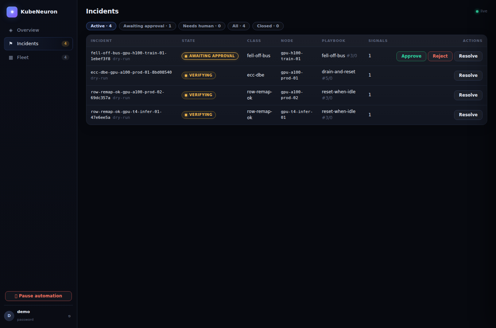
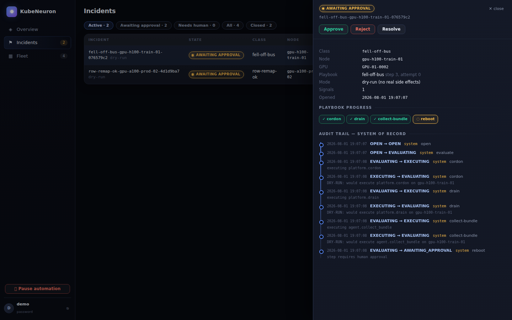
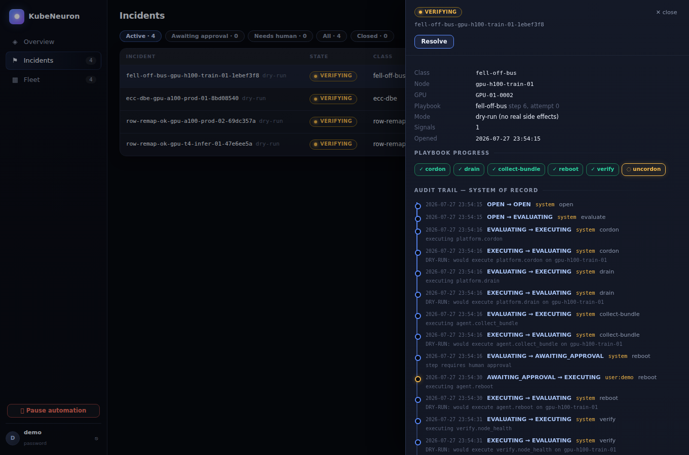
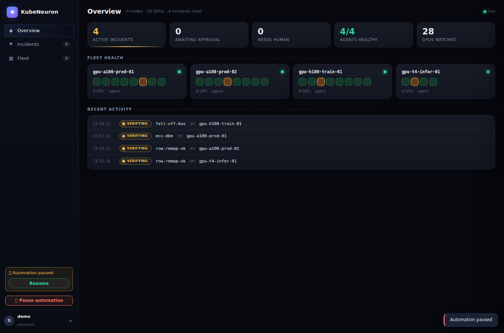
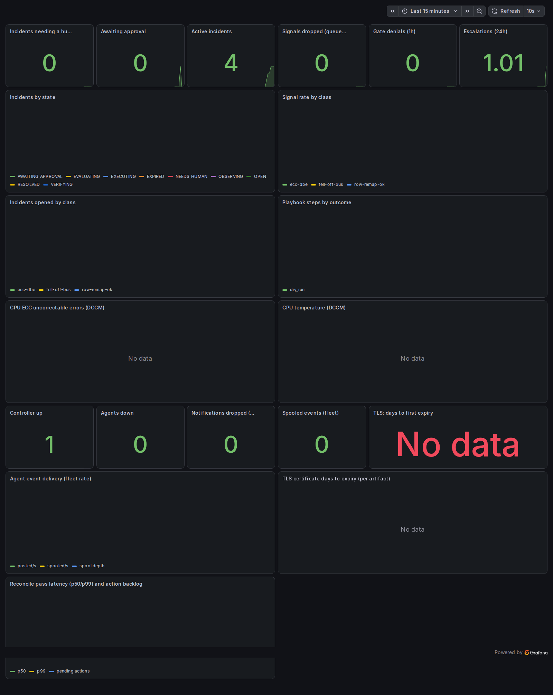
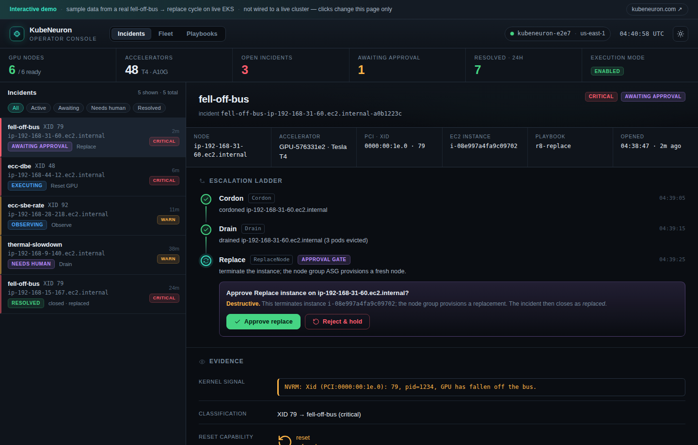
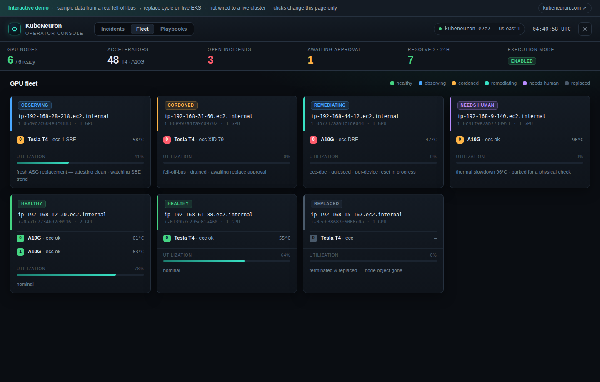
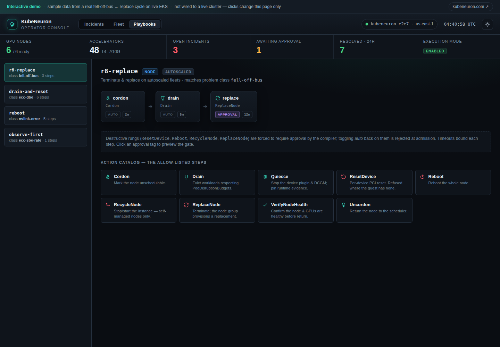

# Product tour

What KubeNeuron does and how you use it, on live, moving data. The panel
and Grafana visuals below were captured against a real controller driving
a simulated four-node GPU fleet (`go run ./test/paneldemo .` — the same
controller binary, playbooks, and API as production, with synthetic XID
events). The identical flow has also been proven end to end on real
hardware — see [Proven on real hardware](#proven-on-real-hardware).

**Demo video:** [kubeneuron-demo.webm](assets/tour/kubeneuron-demo.webm) —
one take: connect, inspect a parked incident, approve the destructive step
as a named human, watch the ladder finish, hit the big red button.

## What you are looking at

KubeNeuron is a vendor-neutral GPU fleet reliability control plane: it
detects degradation, protects workloads, automates safe recovery, and
measures recovered. Detection ships NVIDIA-only today; the fault envelope
and accelerator seam are vendor-agnostic by construction.

Three components, all shipped as distroless images:

| Component | Runs as | Job |
|---|---|---|
| **operator** | Deployment | compiles your CRDs into an immutable config snapshot; owns controller/agent workloads |
| **controller** | Deployment (1 replica SQLite / 2 replicas PostgreSQL HA) | the incident state machine, safety gates, REST API, this panel |
| **agent** | DaemonSet on GPU nodes | kmsg XID watcher, `nvidia-smi` runtime evidence, action executor over mTLS |

## 1. Sign in as yourself

The controller serves an embedded control panel (no separate deployment).
Humans sign in with a username and password from a Kubernetes Secret, or
through **single sign-on** (OIDC — Okta, Keycloak, Dex, Entra, …); an API
token remains for automation. Every mutation is audited under the
identity that made it.



## 2. The fleet at a glance

The Overview answers "does anything need me?" in one look: stat cards for
active incidents, pending approvals, and agent health; **fleet health
cards with a per-GPU grid** — every square is one physical GPU, amber
when it has an incident in flight, red when it waits on a human; and a
recent-activity feed. Here: an A100 production pair, an H100 trainer, and
a T4 inference box — 28 GPUs.



## 3. Incidents, filtered to what matters

Filter chips (active / awaiting approval / needs human / closed) keep the
queue readable at fleet scale. Row-remap events (`row-remap-ok`, XID 63)
ride observe-first playbooks; the ECC double-bit error walked
drain-and-reset; the H100 that fell off the bus is parked at its reboot
approval gate.



## 4. Destructive steps wait for a named human

Clicking an incident opens its drawer: metadata, **playbook progress**
(cordon ✓ → drain ✓ → collect-bundle ✓ → reboot, waiting), and the audit
timeline. `Reboot` is declared `approval: Required` in the playbook — a
CRD admission rule refuses reboot playbooks without it — so the incident
holds in `AWAITING_APPROVAL`, for hours or days if need be, until someone
decides. Approve and Reject exist only in that state.



## 5. The audit trail is the system of record

Click any incident: its full history renders as a timeline — every state
transition, the acting identity, each step's outcome. The golden-ringed
entry is the human approval, recorded as `user:demo` — the identity that
signed in, not a free-text claim; OIDC sign-ins carry the verified email
and API tokens are marked `token:<name>`. In DryRun mode every action is stored as
`DRY-RUN: would execute …` — the workflow runs end to end, the node stays
untouched.



This trail survives controller restarts, upgrades, and (with PostgreSQL)
leader failover — each of those is covered by an automated test.

## 6. The big red button

One click pauses all automation globally: incidents hold position, nothing
new executes, the pause itself is audited, and a banner stays up until an
(audited) resume. Two more independent brakes exist — per-node pause via
`GPUNodeConfig` and time-boxed `GPUMaintenanceWindow`s.



## 7. Grafana: the fleet on one screen

The shipped dashboard (`deploy/grafana/kubeneuron-dashboard.json`,
20 panels) covers both the fleet and KubeNeuron itself: incident states
and rates, playbook step outcomes, escalations, gate denials, agent event
delivery and spool backlog, reconcile latency, notification drops, and
TLS expiry. The dependency profile
(`deploy/kubernetes/dependencies/`) installs a VictoriaMetrics stack whose
vmagent scrapes the controller, agents, and operator automatically; point
any Grafana at it and import the dashboard (UID `kubeneuron-overview`).



The DCGM panels (ECC errors, GPU temperature) fill in when dcgm-exporter
runs on the nodes; the alert pack next to the dashboard
(`KubeNeuronIncidentNeedsHuman`, `KubeNeuronAgentSpoolBacklog`,
`KubeNeuronTLSCertExpiringSoon`, …) ships with per-alert
[runbooks](runbooks.md).

## 8. The operator console

An interactive operator console — **[open it live](https://kubeneuron.com/console)**
— presents the same incident model as three focused views. Every value
below is from a real remediation cycle recorded on live EKS (g4dn / Tesla
T4): a kernel-injected XID 79 (`fell-off-bus`) that walked
cordon → drain → approval → `ReplaceNode` → close-as-replaced.

<video controls autoplay muted loop playsinline poster="assets/tour/console-incidents.png" style="width:100%;border-radius:10px">
  <source src="assets/tour/console-demo.webm" type="video/webm">
  <source src="assets/tour/console-demo.mp4" type="video/mp4">
</video>

The **incident** view is master/detail: the escalation ladder as a
timeline, the destructive step held at an approval gate, the raw kernel
signal and its classification, and the audit trail — including
evidence-based reset refusal, where a virtualized instance has no PCI
reset and the console shows the cloud replace substituted for it.



The **fleet** view is a node map: every GPU node with its accelerators,
ECC state, temperature, utilization, and exactly where it sits in
remediation — healthy, observing, cordoned, remediating, needs-human, or
replaced.



The **playbook** view renders each escalation ladder as a step flow. The
destructive rungs (`ResetDevice`, `Reboot`, `RecycleNode`, `ReplaceNode`)
are forced to require approval by the compiler; the action catalog beside
it is the closed set of allow-listed steps.



## Using it day to day

Everything the panel shows is also in the CLI and REST API:

```console
$ kubeneuronctl incidents               # list, filter by state/node
$ kubeneuronctl show <incident-id>      # detail + audit trail
$ kubeneuronctl approve <incident-id>   # the same approval gate
$ kubeneuronctl pause / resume          # the big red button
```

Configuration is CRDs all the way down — playbooks, policies, maintenance
windows, per-node overrides — compiled by the operator into an immutable,
digest-addressed snapshot (invalid config fails closed; the running
controller keeps its last good snapshot):

```console
$ kubectl get kubeneurons,gpuplaybooks,gpuremediationpolicies
```

See the [operations guide](operations.md), [install guide](install.md),
and [REST API reference](reference-api.md).

## Proven on real hardware

The same flow, unmodified, has been validated on AWS EKS with a real
Tesla T4 (g4dn, AL2023 NVIDIA AMI): the agent ran the host's real
`nvidia-smi` from inside its distroless image via `spec.agent.hostTooling`
mounts, registered the physical GPU (UUID, model, node boot ID), and a
genuine kernel-log injection —

```text
NVRM: Xid (PCI:00000000:00:1E.0): 79, pid=1234, GPU has fallen off the bus.
```

— walked the full cordon → drain → **approval** → reboot → uncordon
dry-run ladder with the approver identity in the audit trail:

```text
OPEN → EVALUATING          [system]           evaluate
EVALUATING → EXECUTING     [system]           cordon   DRY-RUN: would execute platform.cordon
EVALUATING → EXECUTING     [system]           drain    DRY-RUN: would execute platform.drain
EVALUATING → AWAITING_APPROVAL [system]       reboot   step requires human approval
AWAITING_APPROVAL → EXECUTING [token:e2e2-human] reboot DRY-RUN: would execute agent.reboot
EVALUATING → EXECUTING     [system]           uncordon DRY-RUN: would execute platform.uncordon
EXECUTING → VERIFYING      [system]           uncordon
```

## What this tour deliberately did not show

Broad destructive autonomy. `executionMode: Enabled` — real (non-dry-run)
side effects — is supported but off by default, confined by
`spec.safety.destructiveExecution` (a non-empty node selector plus an
exact acknowledgement) and enforced at admission, compilation, controller
dispatch, and the agent executor. Section 8 shows exactly that confined
path live: a real `ReplaceNode` terminating an EKS instance. Autonomy
beyond the confined blast radius stays deliberately gated, and per-device
GPU reset remains hardware-gated (bare metal). DryRun with human-approved,
audited workflows is the recommended production mode today.
